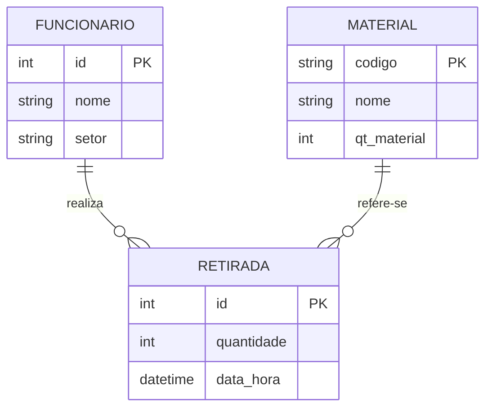
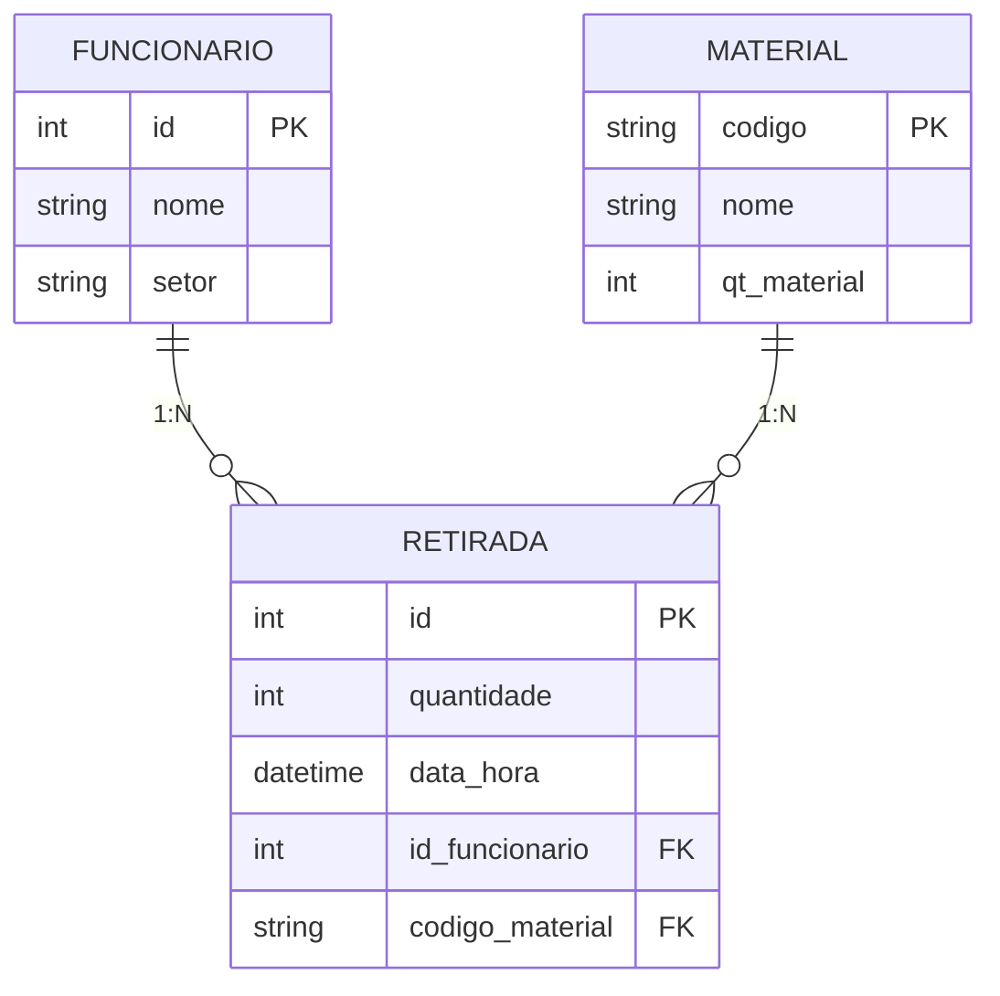

# Sistema de Almoxarifado — Segunda Versão — Rafael Joaquim da Silva, Layse Vitória de Lima Oliveira e Kleiwan Paulo Justino Ludugero 

## Sobre o projeto
O projeto tem como objetivo ajudar a gerenciar um almoxarifado, de forma que tudo possa ser armazenado e organizado de forma mais simples. O sistema permite cadastrar itens e usuarios além de gerenciar os mesmos para melhor controle. OS gerenciamentos possiveis são: Cadastrar usuario, listar usuario e buscar usuario; Cadastrar itens, retirar itens e listar os mesmos.

## Arquitetura

O projeto evoluiu de uma estrutura em 3 camadas para uma estrutura em
4 camadas, com a introdução da camada de **serviços**, responsável por
coordenar as operações da aplicação. A classe principal (`Almoxarifado`)
deixou de concentrar regras de negócio: ela apenas mantém os dados em
memória.

## Estrutura de pastas

```
sistema_alomoxarifado/
├── main.py
├── almoxarifado.py            # aplicação: dados em memória
│
├── modelos/
│   ├── funcionario.py
│   ├── material.py
│   └── retirada.py
│
├── servicos/
│   ├── __init__.py             # instancia os serviços compartilhados
│   ├── funcionario_service.py
│   ├── material_service.py
│   └── retirada_service.py
│
├── excecoes/
│   └── almoxarifado__error.py
│
└── interface/
    ├── menu.py
    ├── tela.py
    ├── menus/
    │   ├── menu_principal.py
    │   ├── menu_funcionarios.py
    │   ├── menu_materiais.py
    │   └── menu_retirada.py
    └── telas/
        ├── tela_pricipal.py
        ├── tela_funcionario.py
        ├── tela_materiais.py
        └── tela_retiradas.py
```

## Responsabilidades

- **Modelos**: representam os objetos do domínio e seus comportamentos
  próprios. `Material` controla sua própria quantidade em estoque
  (`adicionar_estoque` / `retirar_estoque`), levantando exceções quando
  uma operação é inválida.
- **Aplicação (`Almoxarifado`)**: mantém as listas de funcionários,
  materiais e retiradas em memória, com atributos privados e acesso
  controlado por propriedades/métodos.
- **Serviços**: coordenam operações que envolvem um ou mais objetos.
  Por exemplo, `RetiradaService.registrar` localiza o funcionário e o
  material, verifica a quantidade e o estoque, e só então realiza a
  retirada.
- **Exceções**: representam violações de regras de negócio
  (`FuncionarioJaCadastradoError`, `MaterialNaoEncontradoError`,
  `EstoqueInsuficienteError`, `QuantidadeInvalidaError`, etc.). Os
  serviços levantam as exceções; a interface é responsável por
  capturá-las e exibir uma mensagem adequada ao usuário.
- **Interface**: menus e telas cuidam exclusivamente da interação com
  o usuário, delegando toda a lógica aos serviços.

## Fluxo testado

```
Cadastrar funcionário
        ↓
Cadastrar material (com estoque inicial)
        ↓
Registrar retirada válida
        ↓
Consultar estoque
        ↓
Tentar retirar quantidade superior ao estoque
        ↓
Exceção (EstoqueInsuficienteError) apresentada pela interface
```

## Execução

O ponto de entrada continua sendo o mesmo da primeira versão:

```
python main.py
```



## Sobre os diagramas
No modelo conceitual (DER), foram identificadas três entidades — FUNCIONARIO, MATERIAL e RETIRADA — conectadas por dois relacionamentos binários do tipo 1:N: "realiza" (entre FUNCIONARIO e RETIRADA) e "refere-se" (entre MATERIAL e RETIRADA).

Na transformação para o modelo lógico relacional, cada entidade do DER originou uma relação (tabela), e seus atributos identificadores (id, codigo) tornaram-se as chaves primárias correspondentes. Como ambos os relacionamentos possuem cardinalidade máxima 1 do lado de FUNCIONARIO e MATERIAL, e cardinalidade máxima N do lado de RETIRADA, aplicou-se a regra de que a chave primária do lado "1" migra como chave estrangeira para a tabela do lado "N". Por isso, a relação RETIRADA recebeu os atributos id_funcionario e codigo_material como chaves estrangeiras, referenciando respectivamente FUNCIONARIO(id) e MATERIAL(codigo). Não foi necessária a criação de tabelas associativas, pois nenhum dos relacionamentos é N:N. 