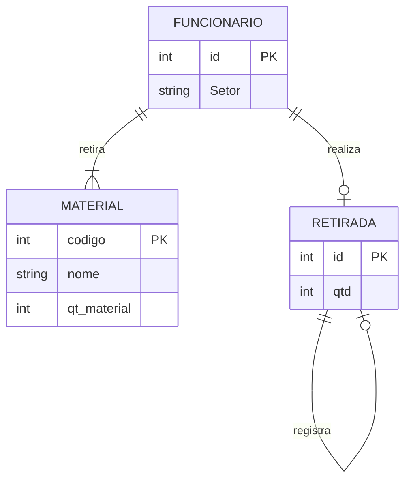

```mermaid
erDiagram
    FUNCIONARIO {
        int id PK
        string Setor
    }

    MATERIAL {
        int codigo PK
        string nome
        int qt_material
    }

    RETIRADA {
        int id PK
        int qtd
    }

    %% Relacionamentos e Cardinalidades
    FUNCIONARIO ||--|{ MATERIAL : retira
    FUNCIONARIO ||--o| RETIRADA : realiza
    RETIRADA ||--o| RETIRADA : registra
```