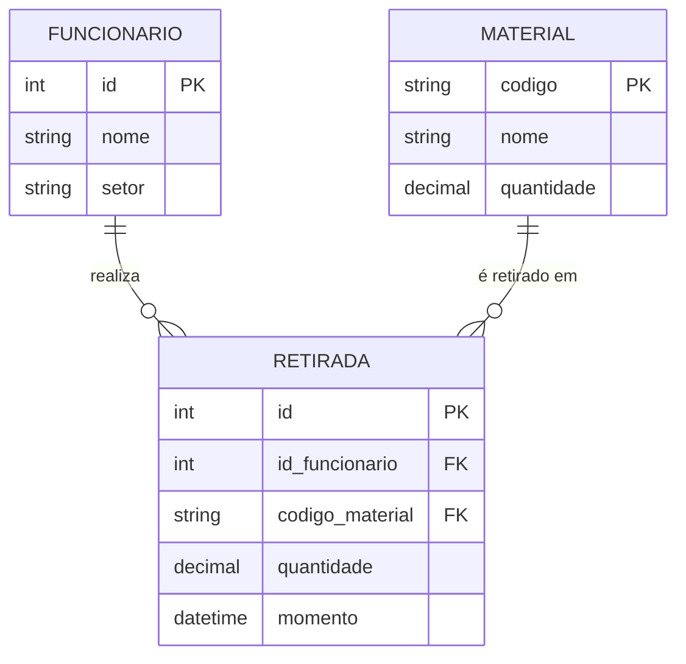

[README.md](https://github.com/user-attachments/files/33009502/README.md)
# Sistema de Almoxarifado

> Projeto Final da disciplina de Programação Orientada a Objetos

## 👥 Equipe

| Integrante |
|---|
| Rafael Joaquim da Silva |
| Layse Vitória de Lima Oliveira |
| Kleiwan Paulo Justino Ludugero |

---

## 💻 Sobre o sistema

### Problema
O controle de materiais em um almoxarifado costuma ser feito de forma manual ou desorganizada (cadernos, planilhas soltas). Isso dificulta saber **quanto há em estoque**, **quem retirou o quê** e **quando**, e abre espaço para erros como retiradas acima do saldo disponível.

### Objetivo
Oferecer um sistema que permita cadastrar funcionários e materiais, registrar as retiradas de materiais feitas pelos funcionários e manter o estoque sempre consistente.

### Cenário de utilização
O sistema é utilizado pelo responsável do almoxarifado de uma organização. Ele cadastra os funcionários que podem solicitar materiais, cadastra os materiais com seu estoque inicial e, a cada solicitação, registra a retirada. O estoque é atualizado automaticamente e o histórico pode ser consultado por funcionário ou por material.

### Principais características
- Cadastro, listagem e consulta de **funcionários** (identificados por ID).
- Cadastro, listagem e consulta de **materiais** (identificados por código), com controle de quantidade em estoque e reposição.
- Registro de **retiradas**, associando um funcionário, um material, a quantidade e a data/hora.
- Consulta do histórico de retiradas por funcionário e por material.
- **Regras de negócio** validadas pelo sistema:
  - não permite cadastrar funcionário ou material duplicado;
  - não permite quantidade menor ou igual a zero;
  - não permite retirar mais do que o estoque disponível.
- Interface de console (menus) e arquitetura em camadas (modelos, serviços, exceções e interface).

---

## 🗄️ Modelo lógico do banco de dados

Este é o modelo de referência para a implementação do banco de dados.



### Descrição das relações

| Relação | Chave primária | Chaves estrangeiras | Descrição |
|---|---|---|---|
| `FUNCIONARIO` | `id` | — | Funcionários que podem retirar materiais. |
| `MATERIAL` | `codigo` | — | Materiais armazenados; `quantidade` é o saldo atual em estoque. |
| `RETIRADA` | `id` | `id_funcionario` → `FUNCIONARIO(id)`<br>`codigo_material` → `MATERIAL(codigo)` | Cada retirada de um material feita por um funcionário, com quantidade e data/hora. |

### Relacionamentos e cardinalidades

- **FUNCIONARIO – RETIRADA (1:N):** um funcionário realiza zero ou várias retiradas; cada retirada é realizada por exatamente um funcionário.
- **MATERIAL – RETIRADA (1:N):** um material pode constar em zero ou várias retiradas; cada retirada se refere a exatamente um material.

> Como o campo `quantidade` de `RETIRADA` guarda o valor retirado e `quantidade` de `MATERIAL` guarda o saldo em estoque, os dois têm significados distintos.

---

## 📁 Estrutura do repositório

```
Projeto-Poo-V02/
└── sistema_alomoxarifado/
    ├── main.py                 # ponto de entrada
    ├── almoxarifado.py         # dados mantidos em memória
    ├── modelos/                # Funcionario, Material, Retirada
    ├── servicos/               # regras e coordenação das operações
    ├── excecoes/               # exceções de regras de negócio
    └── interface/              # menus e telas (console)
```

## ▶️ Como executar

Requer Python 3.

```bash
cd Projeto-Poo-V02/sistema_alomoxarifado
python main.py
```

## 🚧 Status

Nesta versão os dados ficam em memória. O banco de dados será implementado nas próximas etapas, seguindo o modelo lógico acima. Qualquer alteração no modelo durante o desenvolvimento será refletida neste README.
